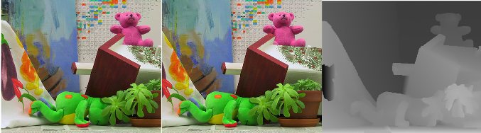

Code for the two papers [1] and [2].

The code is written in Matlab and use mex'ed c++ code for the
optimization parts.

Example result: Two input images and the estimated disparity map.

The code has been tested on MATLAB 2013a with GCC 4.8 on Ubuntu 13.10.

Requirements 
---
1. MATLAB and a c++ compiler.

Getting started
---
1. Run mex -setup.

* In example_global.m Figure 4b) from [1] is reproduced.
* In example_simultanouse.m Figure 4 from [2] is reproduced.
* In example_ncc we show how to use a unary term based on normalized cross correlation.

Third party software
----
The code is bundled with optimization software.

* To perform binary fusion we use roof duality [3].

* To perform simultaneous fusion we use TRW-S [4].

*  The unary and pairwise cost of dispmap_globalstereo is based on [5].

Extend
====
The best way to define a new unary (or any other modifications) is to inherit from dispmap_super.
This is how dispmap_ncc and dispmap_globalstereo is implemented.

Note: Simultaneous Fusion Moves will only work with pairwise cost of the form \alpha(p,q) |p-q|^kernel where kernel\in{1,2}. Overloading the pairwise_cost 
method with a pairwise_cost function of a different from will break simultaneous fusion. Binary fusions can however still be performed. 

References
---

1. [In Defense of 3D-Label Stereo](http://www2.maths.lth.se/vision/publications/publications/view_paper.php?paper_id=566). 
IEEE Conference on Computer Vision and Pattern Recognition (CVPR), 2013. 
 _Carl Olsson, Johannes Ulén, and Yuri Boykov_.

2. [Simultaneous Fusion Moves for 3D-Label Stereo](http://www2.maths.lth.se/vision/publications/publications/view_paper.php?paper_id=571). 
Intentional Conference on Energy Minimization Methods in Computer Vision and Pattern Recognition (EMMCVPR), 2013. 
_Johannes Ulén and Carl Olsson_

3. [Optimizing binary MRFs via extended roof duality](http://pub.ist.ac.at/~vnk/software.html). 
IEEE Conference on Computer Vision and Pattern Recognition (CVPR), 2007. 
_C. Rother, V. Kolmogorov, V. Lempitsky, and M. Szummer_.

4. [Convergent Tree-reweighted Message Passing for Energy Minimization](http://pub.ist.ac.at/~vnk/papers/TRW-S.html). 
IEEE Transactions on Pattern Analysis and Machine Intelligence (PAMI), 2006. 
_Vladimir Kolmogorov_.

5. [Global Stereo Reconstruction under Second-Order Smoothness Priors](http://www.robots.ox.ac.uk/~ojw/2op/). 
IEEE Transactions on Pattern Analysis and Machine Intelligence (PAMI), 2009. 
_Olivier Woodford, Phil Torr, Ian Reid, Andrew Fitzgibbon_.
